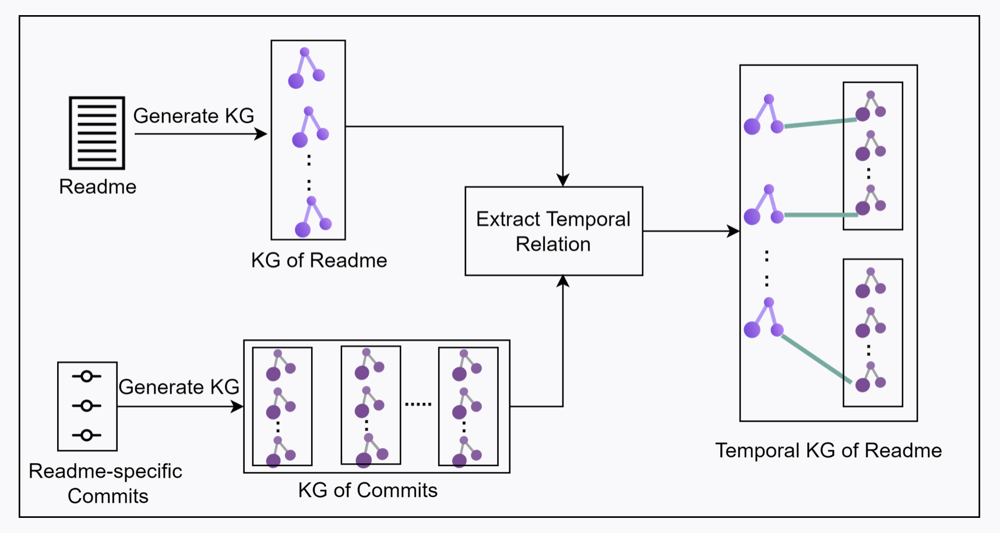
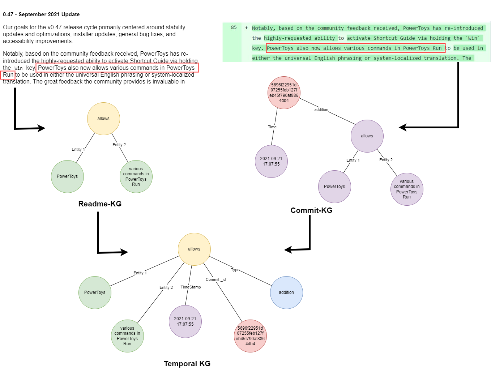

# ReadmeTKG


# What is ReadmeTKG
ReadmeTKG is a tool to construct Temporal Knowledge Graph on the Readme file of a repository.

# Usage of ReadmeTKG
Readme files of the projects serves as an important source of information corresponding to the project such as the dependencies involved, methodology followed and so on. Assessing changes in readme files could provide insights on evolution of the project and consequently could help in modifying the underlying environment or dependencies to work with the project. Linking the readme files with time stamp of changes made to the readme files and further querying the linked data could help in assessing changes in readme files. Generating a temporal knowledge graph specific to readme files using ReadmeTKG could thus link the readme with temporal changes and consequently ease the querying of readme.

# Working of ReadmeTKG
The approach followed ReadmeTKG is summarized below:



ReadmeTKG constructs a Temporal Knowledge Graph on Readme File of a GitHub repository. It first constructs a Knowledge Graph on the present Readme file of the given repository. Then, individual Knowledge Graphs are constructed on changes made by each commit. These individual Knowledge Graphs are combined to obtain the commit based Knowledge Graph.


To construct a Temporal Knowledge Graph Tuple, the tuples present in Readme KG are mapped to equivalent tuple present in Commits KG. Using this mapping, the corresponding commit timestamp and commit SHA are extracted and embedded into the Readme KG tuple to construct the resultant Temporal KG tuple.

A visual representation of an example scenario for a query on ReadmeTKG constructed for Microsoft/PowerToys repository is presented below. The requirement is to obtain information about the timestamp from when the PowerToys has started allowing various commands, for which the query- 'select timestamp where entity1 = "PowerToys" and relation = "allows" and entity2 = "various commands in PowerToys Run" ' applied on the TKG, which resulted in  the timestamp - `2021-09-21 17:07:55'


# Steps to install ReadmeTKG
1. Clone or download this github repository.

2. Get into the main directory:
```bash
cd github-kg
```

3. Download standard-core-nlp-4.3.0 from [this drive link](https://drive.google.com/drive/u/0/folders/1WmS67_kypdYC6gCuK2MYif1a-gJX3TDE). Place this folder in the root directory of this tool.
4. Create and activate a new python3 virtual environment:
```bash
python(3) -m venv <path_to_env/env_name></path_to_env>
```
5. Install the requirements:
```bash
pip install -r requirements.txt
```


# Steps to use ReadmeTKG
To construct a Temporal Knowledge Graph on the readme file of a repository, run the main.py file by passing the repository name as an argument.
```bash
python(3) main.py "<username/reponame>"
```
The resultant files will be placed in results subdirectory.

readme_reponame.csv corresponds to the KG created on the present instance of readme file of the given repository.

commits_reponame.csv and commits_reponame.json corresponds to the KG created on the changes made by commits on the readme file of the given repository.

# How to contribute to ReadmeTKG
Incase of a bug or an enhancement idea, please open an issue or a pull request. Incase of any queries or if you would like to give any suggestions, please feel free to contact Akhila Sri Manasa Venigalla (cs19d504@iittp.ac.in) or Mir Sameed Ali (cs18b021@iittp.ac.in) or Nikhil M (cs18b041@iittp.ac.in) or Sridhar Chimalakonda (ch@iittp.ac.in) of RISHA Lab, IIT Tirupati, India.
